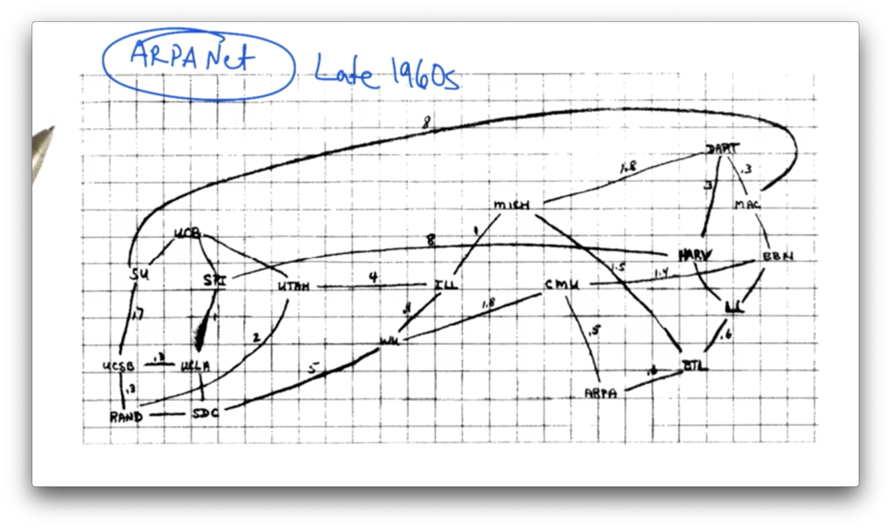
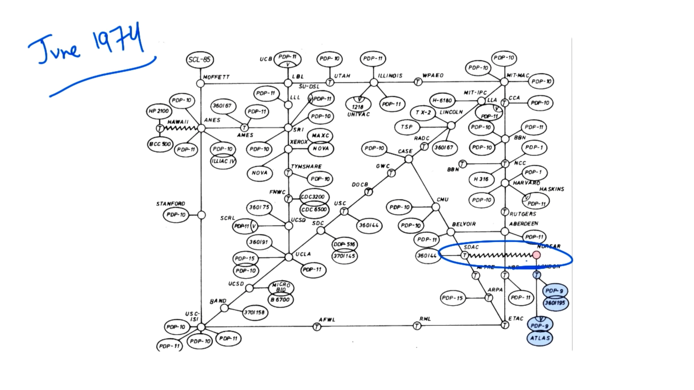
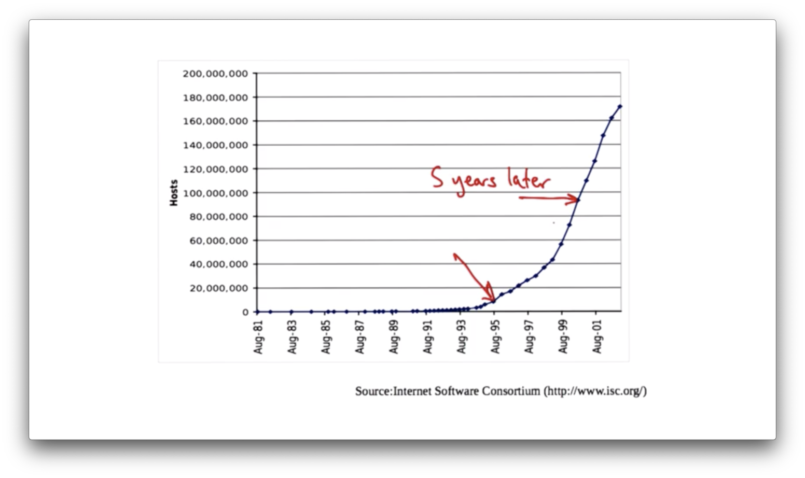
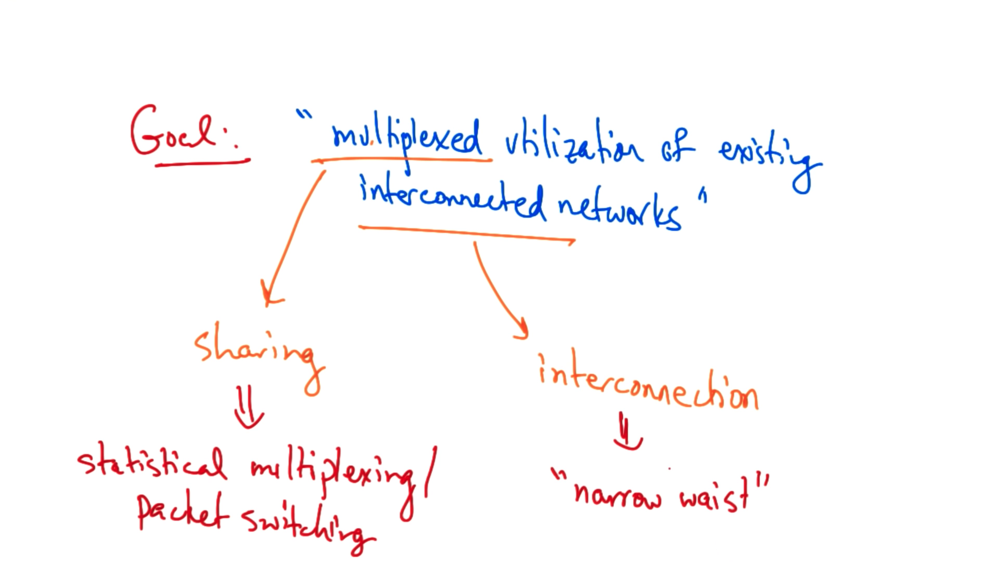
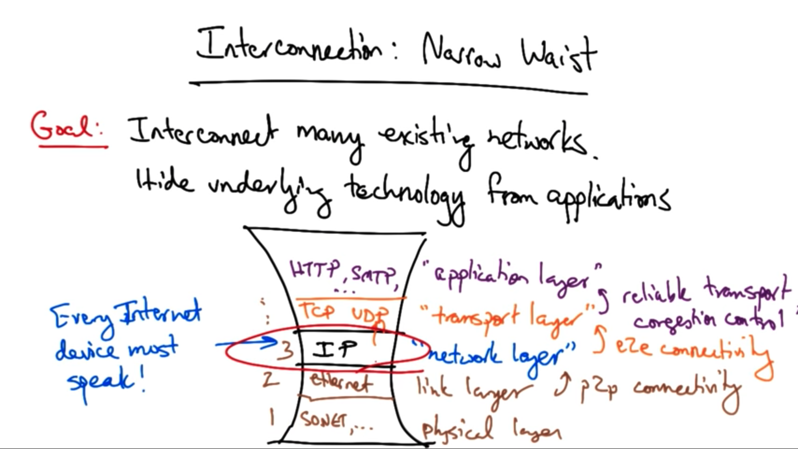
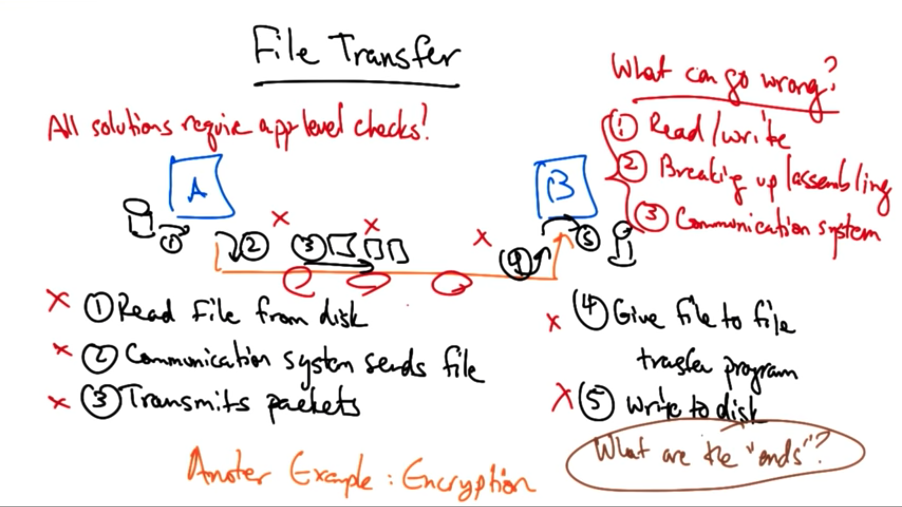
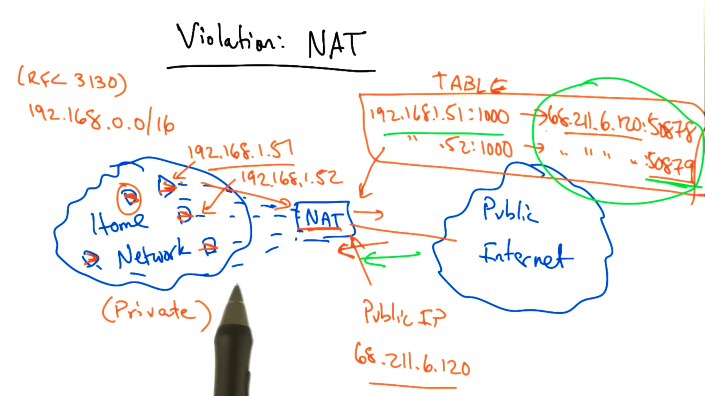

# A Brief History of the Internet

## ARPANet Late 1960s

## ARPANet 1974

## Other networks

SAT Networks (Satellite)
Packet radio networks
Ethernet local area networks (LANs)

## Internet Host Growth

### Growth markers

- DNS (1982)
- TCP congestion control (1988)
- BGP inter-domain routing (1989)
- Streaming media (1992)
- World wide web (1993)
- Altavista search engine (1995)
- P2P applications (2000)

# Problems and Growing Pains

## Running out of addresses

### IPv4

Current version of the internet protocol

-  32-bit addresses

- only has 2^32 (~4B) IP addresses

### Allocated hierarchically

Not allocated efficiently

- e.g. MIT has 1/256 of the entire IPv4 address space

## Congestion control

### Goal

Match offered load to available capacity

### Problem

Current algorithms have insufficient dynamic range
- don't work well over slow and flaky wireless links
- don't work well over very high speed intercontinental paths

## Routing

### Goal

Nodes on the internet discover paths to take to reach another destination.

### Problem of Today's inter-domain routing protocol - BGP

- no security
- easy misconfiguration
- poor convergence
- non-deterministic behavior

## Security

Encryption and authentication are known, but not good when utilizing secure mechanisms and deploying secure applications

## Denial of service

**Distributed denial of service (DDoS)** attacks are common today

# Architectural Design Principles

## Conceptual lessons

Design principles and priorities were designed for a **certain kind of network**

As the internet has evolved, the growing pains resulting from some of those decisions

But they reflect the nature of our understanding at the time, as well as the environment and constraints that the designers faced for the particular network that existed at that time

## Technical lessons

Packet switching, and fate sharing are timeless

# Goal

Multiplexed utilization of existing interconnected networks.

## Packet Switching

To achieve multiplexed utilization - shared use of a single communication channel

## Narrow Waist

To reach connecting networks

# Packet Switching

Information for forwarding traffic is contained in the **destination address** of packet

No state established ahead of time, and very few assumptions made about the level of service that the network provides: the level of service is often called **best effort**

## Enable Sharing

Many senders can send over the same network at the same time, effectively sharing the resources in the network

## Circuit Switching

A signaling protocol sets up the entire path out of band

## Advantage of Packet Switching

Sender never gets a busy signal

Packet switching can share resources and has better resilience properties

## Downside of Packet Switching

Variable delay in message transmission and the potential for packet loss

## Advantage of Circuit Switching

Provides resource control, better accounting and reservation of resources, and the ability to pin paths between sender and receiver

# Narrow Waist

The internet architecture has many layered **protocols**

## IP Layer

At the center is an **interconnection protocol** called the internet protocol (IP)

Every internet device must have an IP stack

As long as a device speaks IP, it can get on the internet

## Transport Layer

Includes protocols like TCP and UDP

Provides certain **guarantees** to the transport layer

### End-to-end Connectivity

A guarantee that a packet destined for a host will be delivered - with best effort - to that host

## Application Layer

Includes many protocols that various internet applications use
- web -> HTTP
- mail -> SMTP.

Transport layer protocols provide various guarantees to the application layer
- reliable transport
- congestion control

## Link Layer

Provides point-to-point connectivity, or connectivity on a local area network

**ethernet** - a common link layer protocol

## Physical Layer

Include protocols such as sonnet for optical networks

## Overall

The design called **IP over anything** or **anything over IP**

## Advantages
Easy to get a device on the network

## Drawback

Difficult to make any changes at IP lay er

# Goals Survivability

The network should continue to work even if some of the devices fail

## Approach 1: Replication

One can just keep state at multiple places in the network, so that when any node crashes, there is always a replica waiting to take over

## Approach 2: Fate sharing

It is acceptable to lose state information for some entity if that entity itself is lost

- e.g. if a router crashes, all of the state on the router - like the routing tables - is lost

# Goals Heterogeneity

## Way 1: TCP/IP

TCP/IP is s a **monolithic** transport where TCP provided **flow control** and **reliable delivery**, and IP provided **universal forwarding**

Not every application need reliable, in-order delivery

- e.g. streaming voice/video often perform well when not every packet is delivered
- e.g. DNS often also does not need completely reliable, in-order delivery

Narrow waist of IP allowed the **proliferation** of many different transport protocols in addition to TCP

## Way 1: Best Effort

The network can lose packets, deliver them out of order, and generally doesn't provide any quality guarantees

The network also doesn't provide information about failures or performance

### Pros

Simple

### Cons

Debugging is hard

# Goals Distributed Management

In addressing, we have **routing registries**
- In North America, the managing organization is called ARIN
-  In Europe the same organization is called RIPE

DNS allows each independent organization to manage its own names

BGP allows each independently operated network to configure its own routing policy

## Pros

No single entity needs to be in charge, which allows for organic growth and stable management

## Cons

The internet has no single **owner**. So very difficult to determine who or what is causing a problem

## Other goals of the internet include

- Cost effectiveness
    - now fairly cost effective
    - aiming to exploit more redundancy
        - web cache

- Ease of attachment
    -  Any device that speaks IP can attach to the internet

- Accountability
    - Wasn't prioritized
    - Packet-switched make accountability really challenging. Payments and billing for internet usage is much less precise than that for phone network usage

# What's Missing?

- Security
- Availability
- Mobility
- Scaling

In paper: Design Philosophy of the DARPA Internet protocols by **Dave Clark**

# End to End Argument

The intelligence required to implement a particular application on the communication system should be placed at the endpoints rather than in the middle of the network.

## Commonly used examples

- error handling in file transfer
- end-to-end encryption
- TCP/IP split in error handling

Sometimes the end to end argument is summarized as **dumb network, intelligent endpoints**

# File Transfer

Computer A wants to send a file to computer B

There can be errors in every single step of this transfer

## Solutions

### Introduce ways atcommunications channel

Steps 2-4

But none of those solutions will be complete

Still require application-level checking

### Provide end-to-end error checking

The application commits or retries based on a checksum of the file

## Encryption

The keys are maintained by the end applications and cipher text is generated before the application sends the message across the network

## What are the Ends?

Vary depending on what the application is

- e.g. if the application involves internet routing, the ends might be routers. If the application/protocol concerns transport, the ends may be the end hosts

# End to End Argument Violations

There are many things that violate the end to end argument

- NAT
- VPN tunnels
- TCP splitting
- Spam filters
- Caches

There are questions about what functions belong in the dumb, minimal network. Can we ever add features? It's worth considering whether the end to end argument is constraining innovation of the infrastructure by preventing us from putting some of the more interesting or helpful functions inside the network

# Violation: NAT

Home gateways -> perform network address translation

We have many devices but only one public IP address

The idea behind network address translation is that we can give each of our devices a **private IP address**

When packets traverse the home router, the source address of every packet is re-written to the public IP address

When traffic comes back to that address, the NAT needs to know which device behind the NAT the traffic needs to be sent to. It uses a mapping of port numbers to identify which device the return traffic should be sent to in the home network

For outbound traffic the NAT creates a table entry, mapping the device's private IP address and port number to the public IP address, and a different port number, and replaces the non-routable private IP address with the public IP address. It also replaces the sender's source port with a different source port that allows it to demultiplex the packets sent to this return address and port

For inbound traffic to the network, the NAT checks the destination port on the packet, and based on the port it rewrites the destination IP address and port to the private IP address in the table before forwarding the traffic to a local device in the home network

The NAT violates the end to end principle because machines behind the NAT are not globally addressable, or routable. So other hosts on the public internet cannot initiate inbound connections to these devices behind the NAT

There are protocols to get around this, like the STUN protocol. In these types of protocols, the device sends an initial outbound packet  to create an entry in the NAT table

Once that entry has been created, we have a globally routable address and port to which devices on the public internet can send traffic

These devices have to learn that public IP address/port that corresponds to that service, which might be done with DNS