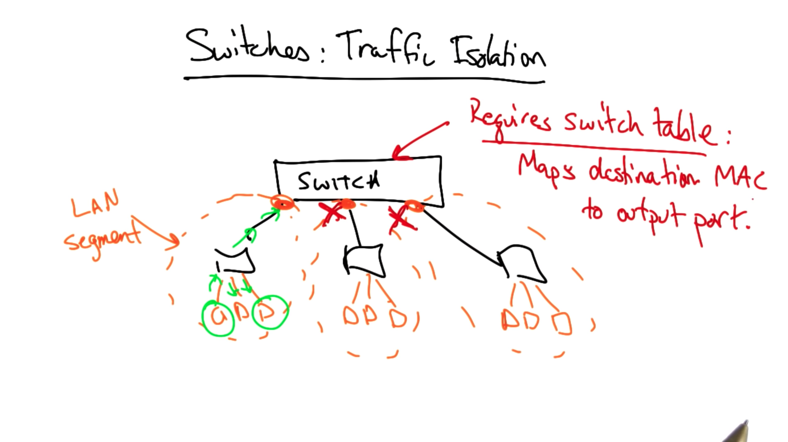

# Switching and Bridging

## Problem

How hosts find each other on a subnet and how subnets are interconnected.

## Also

Difference between
  - switches and hubs
  - switches and routers

Scaling problems

# Bootstrapping: Networking Two Hosts

A host that wants to send a datagram to another host can send it via its **ethernet** adapter with a destination MAC address of the host

a host knows a DNS name or IP address of another host, but it may not know the hardware/MAC address of the adapter on the host

## Address Resolution Protocol (ARP)

For a host to learn the MAC address of another host

# ARP: Address Resolution Protocol

In ARP, a host queries with an IP address, broadcasting that query to every other node on the network

The host that has the IP address on the LAN will respond with the appropriate MAC address

When the host receives a response, it begins to build an ARP table, which maps IP address to MAC addresses

In the future, the host will consult the ARP table to get the MAC address for a given IP address instead of issuing an ARP query out into the network

When the host wants to send a packet to a destination with a particular IP address, it takes the IP packet and encapsulates it in an ethernet frame with the corresponding destination MAC address

# Interconnecting LANs with Hubs

Simplest way to connect a LAN

A hub creates a broadcast medium among all of the connected hosts

If a particular host sends a frame that is destined for another host on the LAN, the hub will broadcast that frame out every outgoing port, so all packets will be seen everywhere

## Cons

- Flooding

- Collision
    - Introduces additional latency because collision requires other hosts to back off and not send as soon as they see other senders trying to send at the same time

- Vulnerable to failures or misconfigurations

     Even one misconfigured device can cause problems for every other device on the LAN

# Switches: Traffic Isolation

A switch will partition the LAN into separate **broadcast/collision domains** or **segments**.

A frame that is bound for a host in the same LAN segment will only be broadcast within that segment

Requires a switch table at the switch which maps destination MAC addresses to switch output ports

# Learning Switches

A learning switch maintains a **table** that maps **destination addresses** to **output ports** on the switch

If there is not an entry in the forwarding table for a given destination address, the switch will just flood all of its output ports

Learning switches do not completely eliminate flooding. They have to flood in the case when destination/port mapping are not present, and they must also flood in the case of broadcast frames, like ARP

Most underlying physical topologies have loops for redundancy. If a given link on the LAN fails, we still wants hosts to be connected

## Forwarding Loop / Broadcast Storm

When two switches are connected in a loop, and one sends a broadcast frame, the other switch will receive it, and broadcast it back out. The first switch will receive it again and rebroadcast it again. This is often referred to as a forwarding loop or broadcast storm

We need a protocol to create a logical forwarding tree on top of the underlying physical topology

# Spanning Tree

A spanning tree is a loop-free topology that covers every node in a graph

## Build Spanning Tree

1. Find thr root

    The switch with the smallest ID is the root

2. Link every switch

    The switch will exclude any link not on the shortest path to root

## Initialization

How to determine the root?

Initially, every node thinks that it is the root, and the switches run an election process to determine which switch has the smallest ID.

If a switch learns of a switch with a smaller ID, it updates its view of the root and computes its distance from the new root.

Whenever a switch updates its view of the root, it also determines how far it is from the root so that when other neighboring nodes receive updates they can determine their distance to new root simply by adding one to any message that they receive

# Spanning Tree Example

# Switches Vs Routers

Switches operate at layer two (the link layer). A common layer two protocol is **Ethernet**

Switches are typically auto-configuring, and forwarding tends to be quite fast, since packets processing in layer two consists only of flat lookups

Routers typically operate at layer three - the network layer - where IP reigns. Router level topologies are not restricted to spanning trees. For example, in multi path routing, a single packet can be sent along one of several possible paths in the underlying router-level topology

Layer two switching is a lot more convenient, but a major limitation is broadcast. The spanning tree protocol messages and ARP queries both impose a fairly high load on the network

Is it possible to get the benefits of layer two switching - auto-configuration and fast forwarding - without the broadcast limitations?

# Buffer Sizing

## Assumptions

- Round trip is 2T (measured in seconds)

- Capacity of the bottleneck link is C (measured in bits/seconds)

## Conclusion

This router need a buffer of size **2T * C** (with units of bits)

**2T * C** -> the number of bits that could be outstanding on this path at any given time

In addition, the bigger the buffers, the bigger the queuing delay. This means that interactive traffic may experience larger delays, and hosts may experience larger delays with regard to feedback about congestion in the network

# Buffer Sizing for a TCP Sender

Suppose that we have a TCP sender that is sending packets, where the sending rate is controlled by the congestion window **cwnd**, and the sender is receiving **ACKs**

With a window cwnd, only cwnd unacknowledged packets may be in flight at any time

**Source's sending rate** R  = w / RTT

TCP uses AIMD strategy for congestion control

For every cwnd ACKs received, we send cwnd + 1 packets, up to the the receiver window, rwnd

We start sending packets using window **cwnd_max / 2 **and increase this window additively up to cwnd_max. When we see a drop, we apply multiplicative decrease, and reduce our window - and thus our sending rate - back to cwnd_max / 2 again

We'd like the sender to send a common rate R before and after the packet drop. Thus:

**cwnd_max / RTT_old = (cwnd_max / 2) / RTT_new**

The round-trip time is controlled by two factors: the propagation delay, and the queueing delay. The propagation delay is 2T, while the queueing delay is B/C, where B is the size of the buffer at the bottleneck link and C is the transmission rate of the bottleneck link

We have both propagation delay and queueing delay before the drop

When the drop occurs, the router buffer contains cwnd_max packets. The sender drops its window size to cwnd_max / 2 and then waits for cwnd_max / 2 ACKs before sending more packets

The delay from router to destination (for packet transmission) is the same as the delay from destination back to router (for ACK transmission). A second packet can be in flight from router to destination while the ACK of the first packet is in flight from destination back to router. For every ACK that has been received by the sender, two packets have left the router and have been processed by the sender. By the time cwnd_max / 2 ACKs have been received, cwnd_max packets have left the router buffer. The router buffer will be empty

All this to say: we only have propagation delay - not queueing delay - after the drop. The queue is empty by the time we start retransmitting packets

As a result, RTT_old = 2T + (B/C) and RTT_new = 2T. Thus:

The rule of thumb makes sense for a single flow, but a router in a typical backbone network has more than 20,000 flows

It turns out that this rule of thumb only really holds if all of those 20,000 flows are perfectly synchronized. If the flows are desynchronized, it turns out that the router can get away with a lot less buffering

# If TCP Flows are Synchronized

If the TCP flows are synchronized, then the dynamics of aggregate window will have the same characteristics as any individual flow

If there are only a small number of flows in the network, these flows may tend to stay synchronized, and the aggregate dynamics may mimic the dynamics of any single flow

As the network begins to support an increasingly larger number of flows, the individual TCP flows become desynchronized

Individual flows may see peaks at different times. Instead of seeing a large sawtooth - which would be the sum of a number of synchronized flows - the aggregate window will look much smoother

We can represent the buffer occupancy as a random variable which will, at any given time, take on a range of values, which can be analyzed by the central limit theorem

The central limit theorem tells us that the more variables (unique congestion windows of TCP flows) we have, the narrower the Gaussian will be. In this case, the Gaussian is the fluctuation of the sum of all of the congestion windows

The width of the Gaussian decreases as 1/sqrt(n) where n is the number of unique congestion windows

As a result, the required buffering for a router handling a large number of flows drops from 2T * C to (2T * C) / sqrt(n)