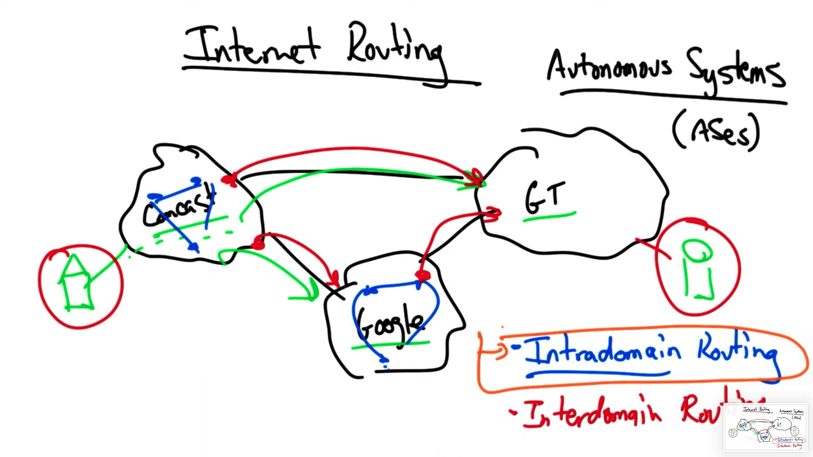
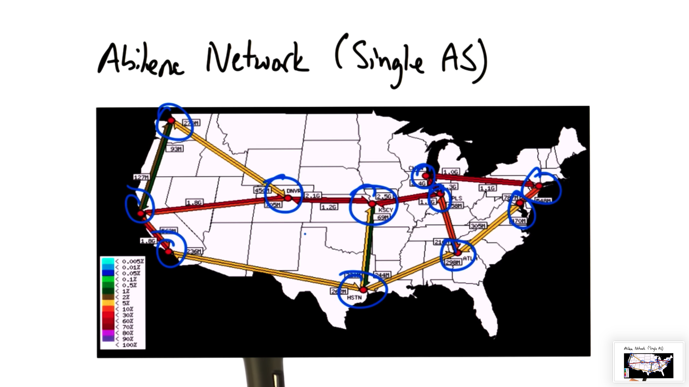
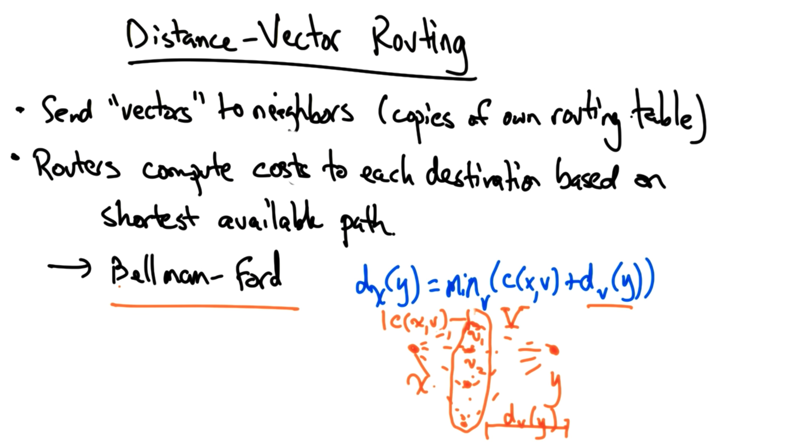
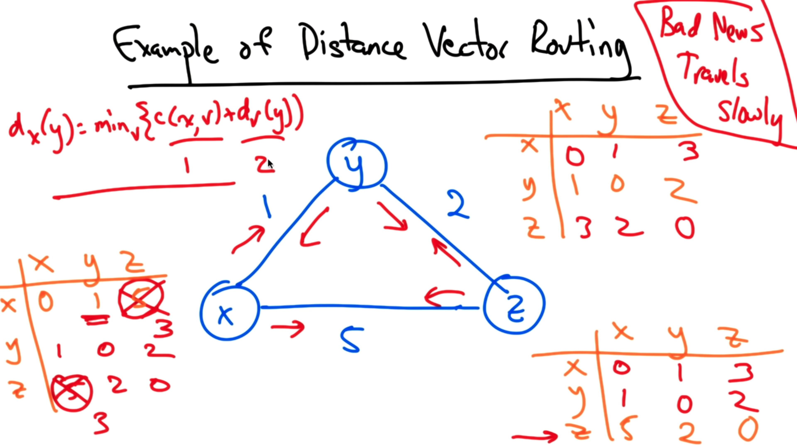
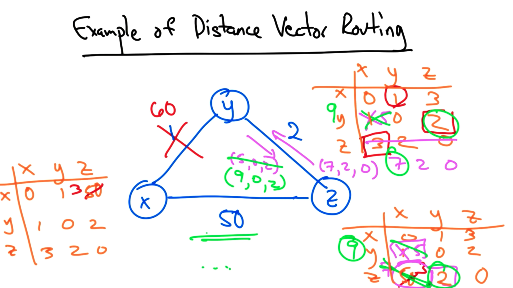
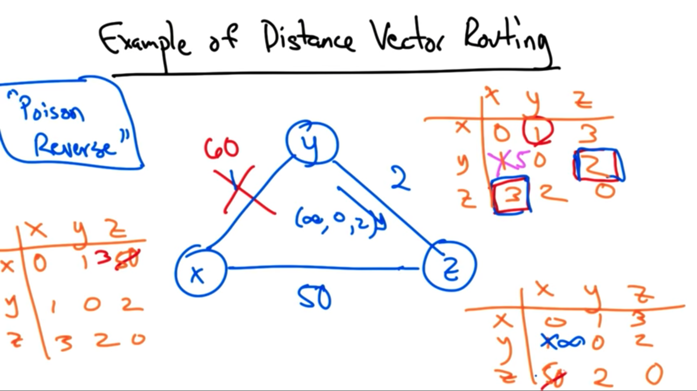

# Internet Routing

The internet is a collection of independent **operated networks(autonomous systems)**
- internet service provider
- content provider
- campus network

Computing a path between a node in an ISP like Comcast and another node in a network like Georgia Tech's involves computation of both interdomain and intradomain paths

## Intradomain routing

Routing within given autonomous system

## Interdomain routing

Routing between autonomous systems

# Intra-AS Topology

## Components

- Nodes (PoPs - points of presence)
    -  located in a dense population center for easier interconnection

- Edges
    - Constrained by the location of fiber paths
    - Parallel major transportation routes

## Abilene Network

## Routing

Pocess for nodes discover where to forward traffic to reaches a certain node

###  Intradomain routing

- Distance vector routing
- Link state routing

# Distance Vector Routing

Each node sends multiple distance vectors - **a copy of the node's routing table** - to each of its neighbors.

Routers compute costs to each destination in the topology based on the shortest available path

Based on **Bellman–Ford algorithm**

## Bellman–Ford algorithm

d_x(y) = min_v{cost(x, v) + d_v(y)}

The minimum cost path from x to y through some intermediate node c is the node v that minimizes the cost between x and v and the already known shortest-cost path between v and y

# Example of Distance Vector Routing

## Example 1

## Example 2

Suppose the cost from x to y increased from 1 to 60

### Update y -> x

y -> z: 2
z -> x: 3 (outdated)

**So** y -> x : 5 and send vector to z

### Update z -> x

z -> y: 2
y -> x: 5

**So** z -> x: 7 and send vector to y

### Problem: Count to Infinity

Above process runs until z realizes that it has a lowest cost path of 50 directly to x

### Solution: Poison Reverse

The idea is that if y must route through z to get to x, then y advertises an **infinite** cost for the destination x to z

This would thus prevent z from routing back through y, allowing z to immediately - and correctly - chose the direct path to x

# Routing Information Protocol

An example of a distance vector routing protocol

## Definition

- Edges have unit cost
- **Infinity** is 16
- Table refreshes occur every 30 seconds or when update occurs

## Split Horizon Rule

When a table entry changes, an update is sent to all neighbors **except** the node that caused the entry change

## Notes

The small value for infinity ensures that the count to infinity doesn't take too long

Every route has a timeout limit of **180** seconds, which is reached hasn't an update from a next hop for six 30 second periods.

When a router or link fails in RIP, things can often take minutes to stabilize

## Cons

- Slow Converge

- Count to infinity problem

# Link State Routing

Each node perfom shortest path computation

Most commonly used in operational networks

Using **Dijkstra's algorithm**

## Common protocols

### Open shortest paths first (OSPF)

### Intermediate System - Intermediate System (IS-IS)

IS-IS has gained increasing use in large ISPs and is the more commonly used link state routing protocol in large transit networks

## Problem

Scale

- The complexity of a link state routing protocol grows as N^3 where N is the number of nodes in the network

# Coping With Scale Hierarchy

One way of coping with scale is to introduce hierarchy. OSPF has the notion of areas and IS-IS has an analogous notion of levels.

In a backbone network, the network's routers may be divided into levels or areas, and the backbone itself may have its own area.

In OSPF, the backbone area is called area 0, and each area in the backbone that is not area 0 has an area 0 router.

In each area, the nodes in that area perform the shortest-path computation to all other nodes within that area.

Intra-area paths are calculated using the simple shortest-path computation, as before.

Paths that must leave an area are now computed by stitching together (1) the shortest path from the origin to the area 0 router in the origin's area, (2) the shortest path across area 0, and (3) the shortest path from the area 0 router in the destination area to the destination.

Interdomain Routing
Internet routing consists out routing between tens of thousands of independently operated autonomous systems.

Each of these networks operate in their own self-interest and have their own economic and performance objectives, and yet they must cooperate to provide global connectivity.

Each autonomous system advertises reachability to some destination by sending route advertisements, using a protocol called the Border Gateway Protocol (BGP).

A router in one AS will receive a route advertisement from a neighboring AS.

A route advertisement may contain many attributes.

A route advertisement might contain a destination prefix - like 130.207.0.0/16.

It might also contain a next hop, which is the IP address of the router that the AS must send traffic to to send traffic along that route. Typically, the next hop IP address is the IP address for the first router in the neighboring AS.

A route advertisement might also contain an AS path, which is a sequence of AS numbers that describe the route to the destination.

The last AS on the AS path is often called the origin AS, because that is the AS the originated the advertisement for the advertised IP prefix.

Route advertisements between border routers in adjacent autonomous systems actually describes a specific type of BGP called external BGP (eBGP).

The routers inside an AS also need to learn routes to external destinations. The protocol to transmit routes for external destinations inside an AS is called internal BGP (iBGP).

To recap:

External BGP (eBGP) is responsible for transmitting routing information between border routers of adjacent ASes.

Internal BGP (iBGP) is responsible for disseminating BGP route advertisements about external destinations to routers inside any particular AS.

IGP vs iBGP
IGP - an intradomain protocol - disseminates routes inside an AS to internal destinations.

iBGP - an interdomain protocol - disseminates routes inside an AS to external destinations.

Suppose a router in AS A is trying to reach a router in AS B. A border router in A learns the route via eBGP, and learns that the next hop to the destination is a border router in B. The router inside A learns the route to B via iBGP, and would learn that the next hop is the border router of A. The router in A will need to utilize IGP to reach its iBGP next hop.

BGP Route Selection
It is often the case that a router in an autonomous system might learn multiple routes to the same destination. In this situation, the router must select a single best route to the destination among the choices. This process is known as the BGP route selection process.

BGP Route Selection Process
Local Preference
The first step in the BGP route selection process is to select a route with a higher local preference value.

The local preference is a numerical value that the network operator in a local AS can assign to a particular route.

This attribute is purely local: It does not get transmitted between ASes. It is dropped from eBGP route advertisements.

It simply allows a local network operator to explicitly state that one route should be preferred over the others.

AS Path Length
Among routes with equally high local preference values, BGP prefers routes with shorter AS path lengths. The idea is that a path might be better if it traverses fewer ASes.

Multi-Exit Discriminator
This step involves comparison of multiple routes advertised from the same AS.

The multi-exit discriminator (MED) value allows one AS to show to a neighboring AS the advertising AS's preference as to which of several links are preferred for inbound traffic

Lower MED values are preferred.

Because the neighboring AS sets the MED value on routes that it advertises to a neighbor, MED values are not inherently comparable across routes advertised from different ASes.

Thus, this step only applies when comparing routes advertised from the same AS.

IGP Path
BGP speaking routers inside an AS will prefer a BGP route with a shorter IGP path cost to the BGP next hop.

If a router inside an AS learns two routes via iBGP, it wants to prefer the one that results in the shortest path to the exit of the network.

This behavior - where an AS sends traffic to the neighboring AS via a path that traverses as little of its own network as possible - is called hot potato routing .

Tiebreak
A tie breaking step may be needed if there are still multiple routes to a destination after the route selection process has finished.

While the tiebreaker can be computed arbitrarily, network operators typically prefer that the selected route be the route advertised by the router with the lowest ID.

Local Preference
Local preference values allow an operator to configure a router to assign different preferences to each of the routes that it learns.

The default local preference value is 100, with higher values indicating that a route is more highly preferred.

An operator can adjust local preference values on incoming routes to control outbound traffic.

This can be extremely useful for configuring primary/backup routes.

While local preference is often used to control outbound traffic, ASes can attach a BGP community (a fancy name for a tag) to a route to affect how a neighboring AS sets local preference, thereby influencing their own incoming traffic.

Let's suppose that AS A wanted to control inbound traffic by affecting how neighboring AS B and AS C set local preference.

If A wants traffic to arrive via B instead of C, A might advertise its BGP routes with "primary" and "backup" communities to B and C, respectively. The "backup" community value might cause a router in C to adjust its local preference value, thus affecting how its outbound traffic choices are made.

This type of arrangement requires prior agreement between A, B, and C. B and C must be able to understand and respond to community values attached to route advertisements originating from A.

Multiple Exit Discriminator
Suppose that two ASes connect in two different cities: San Francisco and New York.

Also suppose that AS 1 wants traffic to destination d to enter via NYC rather than via the link in SF.

Recall that, all things being equal, a router in AS 2 will select the BGP route with the shortest IGP route to the next hop.

This means that some routers in AS 2 might select the SF egress, and others might select the NYC egress.

To override this default hot potato routing behavior, AS 1 might advertise its BGP routes to AS 2 with MED values.

If the NYC route is advertised with a lower MED value than SF route, then all of the routers in AS 2 that would have chosen the SF route will now choose the NYC route.

This is because the preference for a lower MED value comes before the preference for the shortest IGP path in the route selection process.

MED allows an advertising AS to explicitly specify that it wants a neighboring AS to carry traffic on its own backbone network rather than dumping the traffic at the nearest egress and forcing the advertising neighbor to carry the traffic.

MEDs are typically not used in conventional business relationships, but would be used in the case where AS 1 doesn't want AS 2 free-riding on the backbone network of AS 1.

This mechanism is sometimes used when a transit provider peers with a content provider, and the transit provider doesn't want the content provider essentially getting free transit through it.

In the absence of MED, a router inside AS 2 will learn multiple routes to destination d via multiple egress points, and would simply pick the next hop with the lowest IGP path cost.

It is very common to set IGP costs in accordance with distance/propagation delay, which results in routers inside the AS picking shorter paths based on distance.

One problem with hot potato routing is that a small change in IGP path cost can result in a lot of BGP route changes.

There has been effort to improve the stability of the BGP routing by decoupling BGP and IGP in this part of the route selection process.

Interdomain Routing Business Models
In the internet there are two different types of relationships: customer-provider and peer-peer.

In a customer-provider relationship, money flows from the customer to the provider, regardless of the direction of traffic flow.

In a peering relationship, an AS can exchange traffic with another AS free of charge. This is also called settlement-free peering.

Thus, the basic rule of preference in interdomain routing: Customer routes are preferred over peer routes, which are preferred over provider routes.

In addition to preferences decisions, an AS also needs to make filtering/export decisions. That is, when an AS learns a route from its neighbor, to whom should it re-advertise that route?

Let's suppose that an AS learns routes to its destination from its customer, peer and provider.

For the route that is learned from the customer, the AS will wants to re-advertise that route to everyone. Every time that route is used, the AS will make money.

On the other hand, for the route that is learned from a provider, the AS will only re-advertise this route to customers. This way, the AS will only pay money when it is also making money.

Likewise, routes from peers would also only be advertised to customers, not to other peers or providers.

If every AS followed these rules exactly, then routing stability is guaranteed. Isn't routing stability guaranteed already?

Nope!

Interdomain Routing Can Oscillate!
Consider the following topology where each AS specifies preferred paths to AS 0, presumably by local preference.

Each AS prefers the AS in the clock-wise direction, instead of the shorter, direct path to AS 0.

Suppose that we start off with everyone selecting the direct path.

In this case, any one of these ASes would notice that it had a more preferred path.

For example, AS 1 would see that since AS 3 has chosen the direct path, it can choose its preferred path, 1->3->0.

AS 3 sees that it has a more preferred path available - 3->2->0 - so it might switch to that.

In doing so, however, the path from AS 1 to AS 0 is broken. AS 1 now has to switch to its less-preferred direct path.

Now AS 2 sees that its preferred path is available, which now breaks the path from AS 3 to AS 0. This causes AS 3 to switch to its less-preferred direct path.

These oscillations continue ad infinitum.

This pathology has been formalized and conditions for routing stability - known as safety - have been derived.

If ASes follow the ranking and export rules described in the previous section, safety is guaranteed.

However, there are various times when those rules are violated.

To this day, BGP is not guaranteed to be stable in practice, and many common practices result in the potential for this type of oscillation to occur